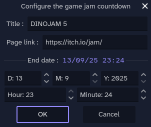
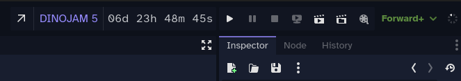

# Jam Countdown Plugin for Godot

A simple countdown timer for game jams, displayed directly in the Godot editor toolbar.

## Features

- Displays a real-time countdown in the main editor toolbar.
- Click on the jam title to open a configuration panel.
- Set the jam's title, end date, and end time.
- Add an optional link to the jam page, accessible via a small icon.
- Settings are saved per-project.

## Installation

1. Download the plugin from the Godot Asset Library.
2. Copy the `addons/jam_countdown` folder into your project's `addons` folder.
3. Go to **Project > Project Settings > Plugins** and enable the "Jam Countdown" plugin.

## How to Use

- Once enabled, the countdown will appear in the top of the editor, it should be at the left of the "Run Project" button.
- By default, it's set for a game jam named "WeekJam" ending 7 days from now.
- Hover over the countdown to see a tooltip with the end date

1. Click on the jam title (e.g., "WeekJam") to open the configuration dialog.
2. Set your jam's title, end date/time, and an optional URL to the jam page.
3. Click "OK". The countdown will update immediately with your new settings.

## License

This plugin is available under the MIT License. See the `LICENSE` file for more details.
